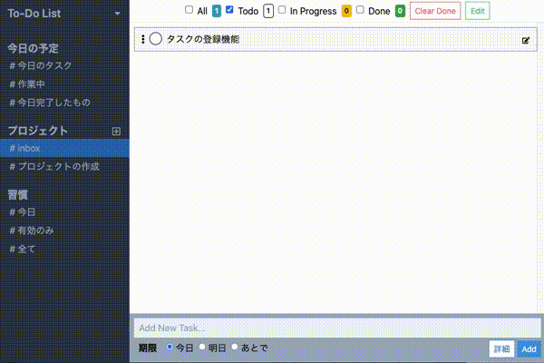
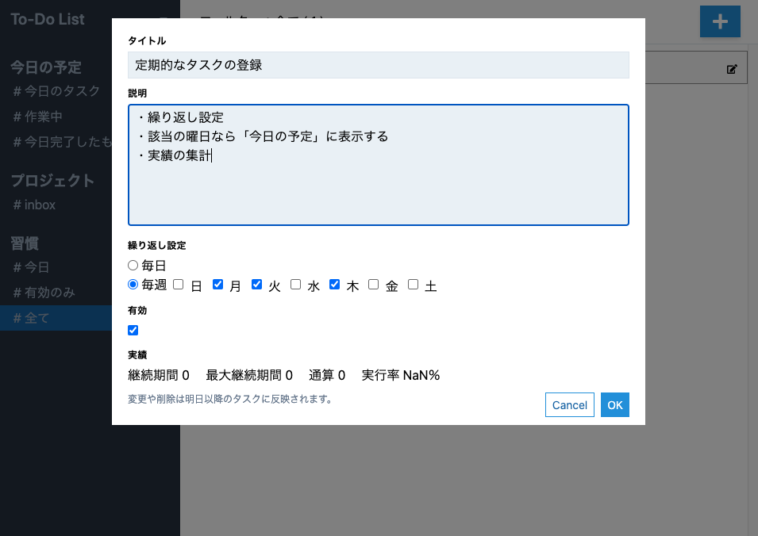
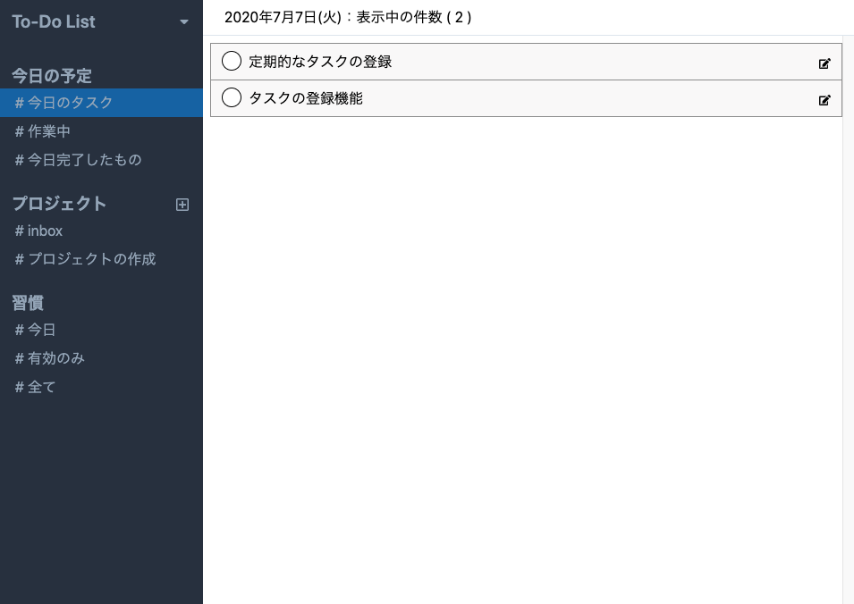

What to do Today
===
タスク管理ツール




## 機能

### 1. プロジェクト単位でのタスク管理
* 3段階のステータス管理
* 期間設定


### 2. 定期的なタスクの管理(習慣タスク)
* 繰り返し設定
* 実績の表示



### 3. 今日の予定を表示
* 今日のタスクをプロジェクト、習慣タスクを横断的に表示する




## 技術一覧

* Nuxt.js
* Vue.js
* JavaScript
* Firebase
  * Firestore
  * Hosting
  * Authentication
* PWA
* ライブラリ
  * Font Awesome
  * Tailwind CSS


## Firestore エミュレータ設定

* version: 10.6.0

### インストール

```bash
$ npm install -D firebase-tools

$ npx firebase init

? Which Firebase features do you want to set up for this directory? Press Space to select features, then Enter to confirm yo
ur choices. (Press <space> to select, <a> to toggle all, <i> to invert selection, and <enter> to proceed)
 ◯ Hosting: Configure files for Firebase Hosting and (optionally) set up GitHub Action deploys
 ◯ Hosting: Set up GitHub Action deploys
 ◯ Storage: Configure a security rules file for Cloud Storage
❯◉ Emulators: Set up local emulators for Firebase products
 ◯ Remote Config: Configure a template file for Remote Config
 ◯ Realtime Database: Configure a security rules file for Realtime Database and (optionally) provision default instance
 ◯ Firestore: Configure security rules and indexes files for Firestore


? Which Firebase emulators do you want to set up? Press Space to select emulators, then Enter to confirm your choices. (Pres
s <space> to select, <a> to toggle all, <i> to invert selection, and <enter> to proceed)
❯◯ Authentication Emulator
 ◯ Functions Emulator
 ◉ Firestore Emulator
 ◯ Database Emulator
 ◯ Hosting Emulator
 ◯ Pub/Sub Emulator
 ◯ Storage Emulator

? Which Firebase emulators do you want to set up? Press Space to select emulators, then Enter to confirm your choices. Firestore Emulator, Hosting Emulator
? Which port do you want to use for the firestore emulator? 8080
? Which port do you want to use for the hosting emulator? 5000
? Would you like to enable the Emulator UI? Yes
? Which port do you want to use for the Emulator UI (leave empty to use any available port)?
? Would you like to download the emulators now? (y/N) y

# firebase.jsonに設定が追記される
```

### エミュレータ起動

```bash
# エミュレータ起動
$ npx firebase emulators:start

# エミュレータのデータをエクスポート
# (エミュレータのUIで事前にデータを作成)
$ npx firebase emulators:export <エクスポート先フォルダ>

# データをインポートして起動
$ npx firebase emulators:start --import=<エクスポート先フォルダ>

# エミュレータのデータと同期
npx firebase emulators:start --import=<エクスポート先フォルダ> --export-on-exit=<エクスポート先フォルダ>
```

### デプロイ

複数サイトをホスティングするため、デプロイ時にターゲットを指定する

* タグ(`firebase.json`のhosting.targetの値)を指定して、デプロイ
* このプロジェクトは`default`
* `.firebaserc`を参照(Git管理外)
* https://firebase.google.com/docs/hosting/multisites?hl=ja#set_up_deploy_targets

```bash
# firebase deploy --only hosting:TARGET_NAME
$ npx firebase deploy --only hosting:default
```