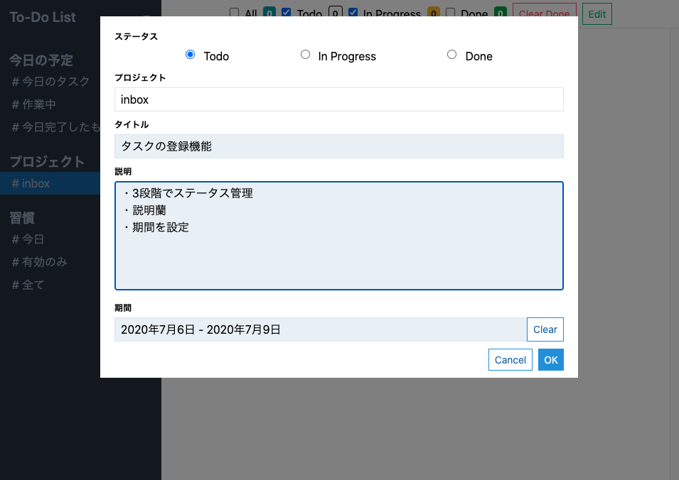

What to do Today
===
タスク管理ツール

## App URL

https://what-to-do-today-b80b0.web.app

## 機能

### 1. プロジェクト単位でのタスク管理
* 3段階のステータス管理
* 期間設定

### 2. 定期的なタスクの管理(習慣タスク)
* 繰り返し設定
* 実績の表示

### 3. 今日の予定を表示
* 今日のタスクをプロジェクト、習慣タスクを横断的に表示する

## 技術一覧

* Nuxt.js
* Vue.js
* JavaScript
* Firebase
  * Firestore
  * Hosting
  * Authentication
* PWA
* ライブラリ
  * Font Awesome
  * Tailwind CSS

## 工夫したポイント
### 設計面

* 拡張性：DBへのアクセスをDAOにすることで、Firebase以外のサービスへの切り替えをしやすくしました
  * IndexdDBを使用したオフライン版の作成も可能

### UX面

* タスクを複数登録しやすいように、登録フォームを設計
* タスクの並び順を変更できる機能

 

## 今後実装予定

* スマホ対応
* electron化

## 製作背景

タスク管理アプリを色々使ってみたが、自分に合うアプリがなかったり、複数使うと管理が煩雑になるので、一元管理できるアプリを作りました。
